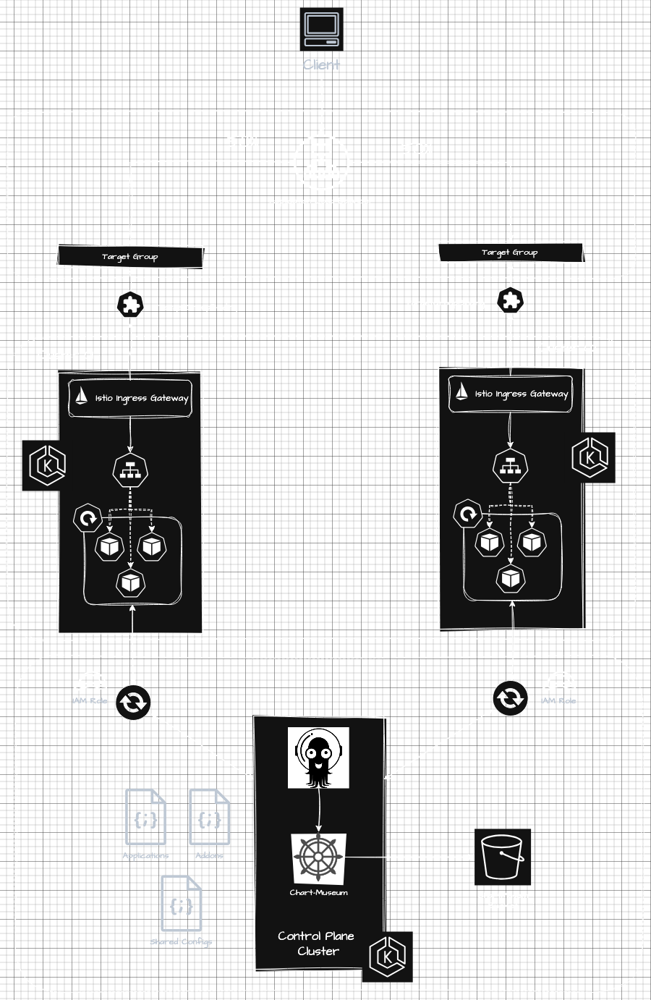
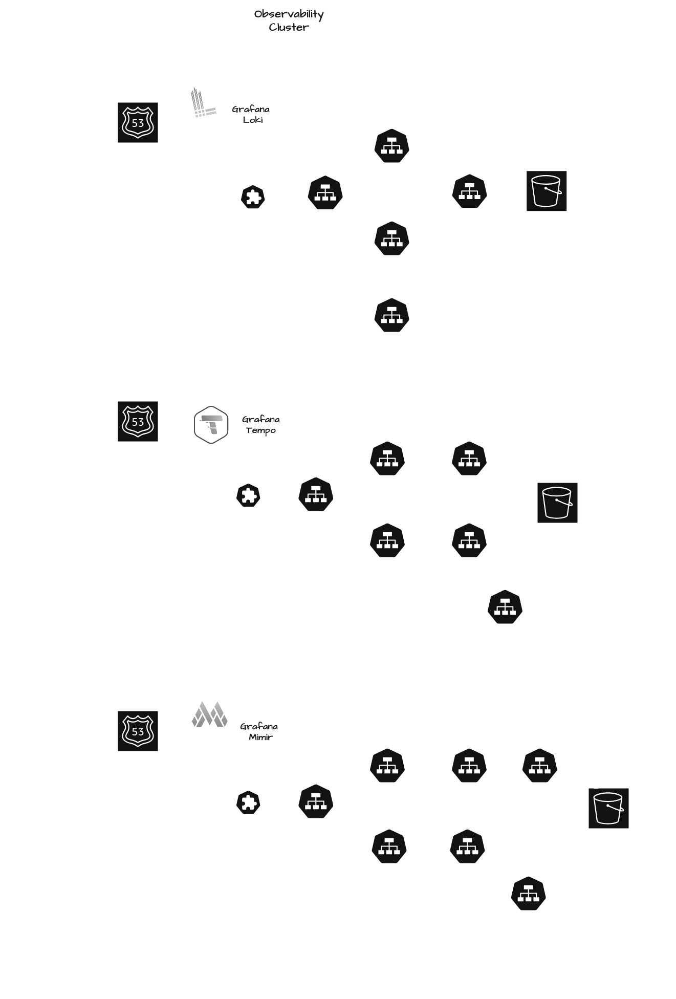
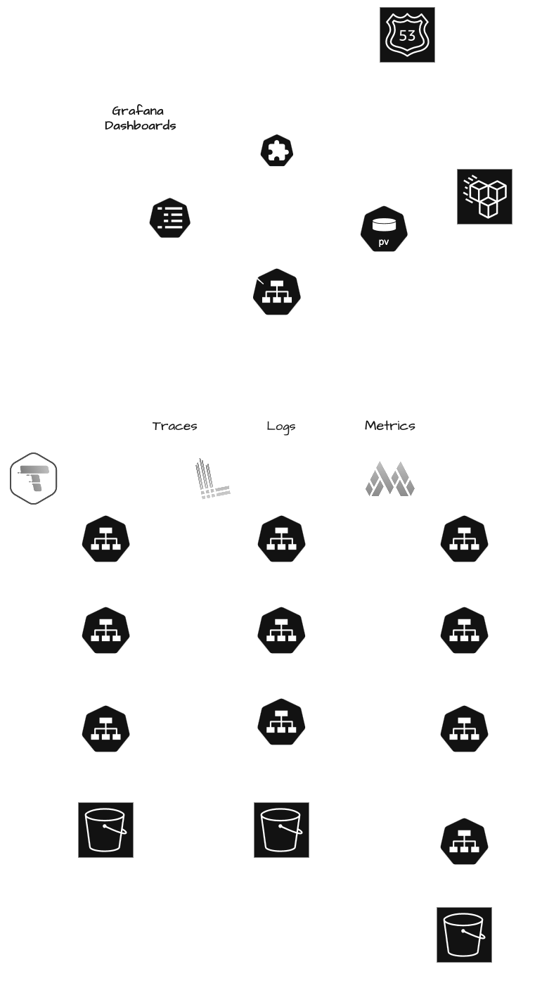

# aws-eks-final-project

A distributed environment running multiple Kubernetes clusters on AWS. Helm
charts, addons and application workloads are managed centrally with ArgoCD, and
an observability stack receives traces, logs and metrics from multiple sources
and exposes them for consumption in Grafana.

Like the [ECS project](https://github.com/freeitas/aws-ecs-final-project), the
goal is to provide mechanisms for scaling sustainably and resiliently in
medium-to-large corporate environments.

## Part one — multi-cluster management with ArgoCD

The first part uses ArgoCD as a control plane, so the contents of multiple
clusters can be managed simply and safely. The proposed architecture has **two
production clusters in an active/active model**, a **load balancer that controls
the percentage of traffic distributed between them**, customizable through
Terraform, and an **ArgoCD cluster with permission to deploy resources into both
production clusters**.

The model allows any cluster to be taken fully out of rotation for maintenance,
testing or upgrades.

## Part two — observability cluster

### Main components

- **Grafana Loki**: log indexing
- **Grafana Tempo**: trace and span indexing
- **Grafana Mimir**: Prometheus metrics indexing
- **Grafana Dashboard**: visualization of data, metrics, logs and traces
- **FluentBit**: collects Kubernetes logs and ships them to Loki
- **OpenTelemetry Collector**: ships traces and spans to Tempo
- **Prometheus**: collects metrics and ships them to Mimir

### Grafana read path — datasources

## Related repositories

| Component | Repository |
|---|---|
| VPC / networking | [aws-eks-networking](https://github.com/freeitas/aws-eks-networking) |
| EKS clusters | [aws-eks-cluster](https://github.com/freeitas/aws-eks-cluster) |
